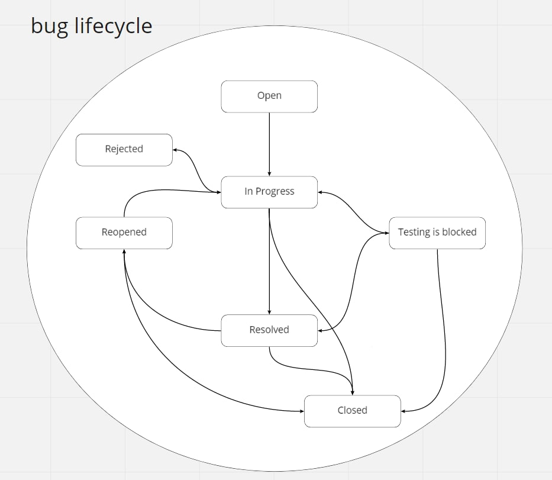

# База знаний QA

## Сообщества
⭐ **Testing Support** https://t.me/joinchat/L607PFPVuwE1YTcy

⭐ Kazan qa community chat. [search in telegram]

⭐ Серьезный тестировщик https://t.me/serious_tester

⭐ QA juniors https://t.me/qajuniors

⭐ QA @meetup_chat https://t.me/qa_innomeetup

🐍 Zen of Python https://t.me/zen_of_python

🎭 JavaScript testing https://t.me/js_for_testing

⭐ Burnt out SDET https://t.me/burntout_sdet

⭐ QA — русскоговорящее сообщество https://t.me/qa_ru

⭐ automated-testing.info https://t.me/atinfo

💰 QA — вакансии и аналитика рынка вакансий https://t.me/qa_jobs

💰 QA - Finance https://t.me/qa_fin

📚 QA — Курсы и образование https://t.me/qa_courses

## Ссылки на youtube/книги/статьи
🇷🇺 Start of API testing project JS https://www.youtube.com/watch?v=HmzT298UOy8&t=10s

🇷🇺 Как стать тестировщиком ПО / Все о QA / Интервью с Senior QA Engineer https://www.youtube.com/watch?v=NVqxL769c0U&t=5s

## Файлы
bug lifecycle

